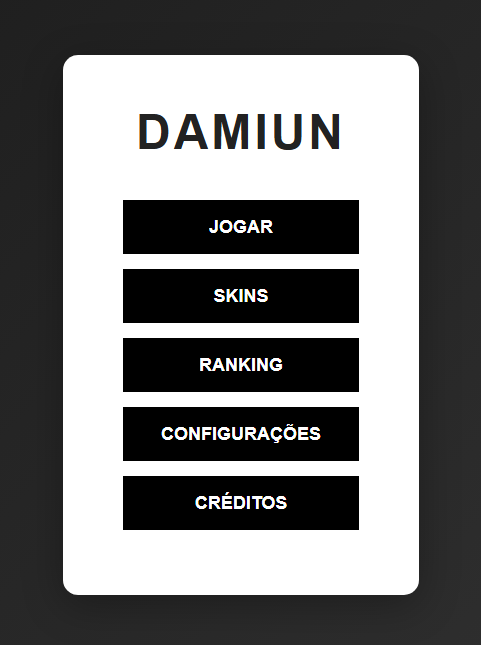
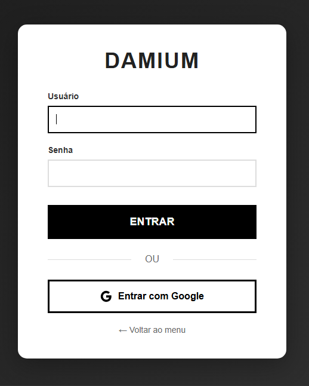

# Damium


O Damium é um jogo de damas para dispositivos móveis que busca modernizar a experiência do clássico jogo de tabuleiro. Nosso objetivo é oferecer uma plataforma intuitiva e personalizável, combinando a tradição das damas com recursos modernos de jogos online.

## Descrição Completa do Projeto

### Visão Geral
O **Damium** é uma aplicação mobile desenvolvida em React Native/Expo que reimagina o tradicional jogo de damas com uma abordagem moderna e intuitiva. O projeto combina a estratégia clássica das damas com recursos contemporâneos como personalização visual, sistema de usuários e interface responsiva.

### Objetivos do Projeto
- **Modernizar o jogo de damas**: Criar uma versão digital acessível e atrativa do jogo tradicional
- **Experiência personalizada**: Oferecer diferentes temas visuais e opções de customização
- **Conectividade social**: Implementar sistema de usuários com perfis e histórico de partidas
- **Interface intuitiva**: Desenvolver uma UI/UX moderna e fácil de usar
- **Multiplataforma**: Garantir funcionamento em dispositivos iOS e Android
- **Performance otimizada**: Assegurar jogabilidade fluida em diferentes dispositivos

## Público-alvo
Jogadores casuais de todas as idades, entusiastas de jogos de estratégia, e aqueles que buscam uma experiência competitiva em dispositivos móveis. O app é ideal para quem quer jogar damas de forma rápida ou se aprofundar em partidas estratégicas com um sistema de ranking.

## Instruções de Instalação

### Pré-requisitos
- **Node.js** (versão 18 ou superior)
- **npm** ou **yarn**
- **Expo CLI** (instalar globalmente)
- **Git** (para clonagem do repositório)

### Instalação Passo a Passo

1. **Clone o repositório**
   ```bash
   git clone <url-do-repositorio>
   cd Checkers
   ```

2. **Instale as dependências**
   ```bash
   npm install
   # ou
   yarn install
   ```

3. **Instale dependências específicas do Expo**
   ```bash
   npx expo install expo-av expo-router expo-splash-screen
   npm install firebase @react-navigation/native
   ```

4. **Configure o Firebase**
   - Crie um projeto no [Firebase Console](https://console.firebase.google.com/)
   - Adicione as configurações em `src/services/firebase.js`
   - Configure Firestore Database e Authentication

5. **Inicie o projeto**
   ```bash
   npx expo start
   ```

6. **Execute no dispositivo**
   - Use o app **Expo Go** no seu smartphone
   - Escaneie o QR code gerado
   - Ou use um emulador Android/iOS

### Configuração Adicional
```bash
# Para desenvolvimento web
npx expo start --web

# Para build de produção
npx expo build:android
npx expo build:ios
```

## Lista de Funcionalidades

### ✅ Funcionalidades Implementadas

#### **Sistema de Jogo**
- 🎮 **Motor de jogo de damas completo** com todas as regras tradicionais
- 👑 **Sistema de promoção a dama** automático
- 💥 **Capturas obrigatórias** e capturas múltiplas em sequência
- 🎯 **Validação de movimentos** em tempo real
- 🏁 **Detecção automática de vitória**

#### **Interface e Experiência do Usuário**
- 🎨 **Sistema de skins personalizáveis** para tabuleiro e peças
- 📱 **Interface responsiva** adaptável a diferentes tamanhos de tela
- ⚡ **Animações fluidas** e feedback visual
- 🎵 **Sistema de áudio** com música de fundo nos créditos
- 🌟 **Menu principal interativo** com navegação intuitiva

#### **Sistema de Usuários**
- 🔐 **Autenticação Firebase** (login/registro)
- 👤 **Perfis de usuário** com informações personalizadas
- 💾 **Salvamento automático** de preferências e configurações
- 📊 **Histórico básico** de escolhas do usuário

#### **Navegação e Estrutura**
- 🧭 **Roteamento com Expo Router** 
- 📱 **Suporte a navegação nativa** (botões físicos)
- 🎬 **Tela de créditos** com animações cinematográficas
- ⚙️ **Telas de configuração** para personalização

#### **Recursos Técnicos**
- 🔥 **Integração Firebase** para backend
- 📱 **Otimização para dispositivos móveis**
- 🎨 **Sistema de temas** dinâmico
- ⚡ **Performance otimizada** com componentes nativos

### ❌ Funcionalidades Planejadas (Não Implementadas)

#### **Multijogador e Conectividade**
- 🌐 **Modo multijogador online** em tempo real
- 👥 **Sistema de amigos** e convites
- 🏆 **Ranking global** e competições
- 💬 **Chat durante partidas**

#### **Inteligência Artificial**
- 🤖 **IA para jogo solo** com diferentes níveis de dificuldade
- 📚 **Sistema de dicas** e sugestões de jogadas
- 📈 **Análise de partidas** com estatísticas detalhadas

#### **Recursos Avançados**
- 🎥 **Gravação e replay** de partidas
- 📊 **Estatísticas detalhadas** de performance
- 🏅 **Sistema de conquistas** e badges
- 💰 **Economia interna** com moedas virtuais

#### **Personalização Avançada**
- 🎨 **Editor de temas** personalizado
- 🔊 **Efeitos sonoros** customizáveis
- 🌍 **Múltiplos idiomas**
- ♿ **Recursos de acessibilidade**

## Membros do Grupo e Créditos

### Equipe de Desenvolvimento

| Integrante                             | Função/Responsabilidade Principal | Contribuições Específicas |
| -------------------------------------- | --------------------------------- | ------------------------- |
| **Gianlucca Francisco Celani Machado** | **Líder do Projeto** & Full-Stack Developer | Arquitetura geral, Firebase, Sistema de usuários |
| **Elias Daniel Dias**                  | UI/UX Designer & Frontend        | Design de interface, Estilização |
| **Gustavo Aleixo da Silva**            | Frontend Developer               | Lógica de navegação, Componentes |
| **João Paulo Lucio Aparecido**         | Backend Developer                | Integração de dados, APIs |

### Distribuição de Funcionalidades por Desenvolvedor

#### **Gianlucca Francisco Celani Machado**
- 🔥 **Integração Firebase** completa (Authentication, Firestore)
- 🎮 **Motor do jogo de damas** (lógica principal, regras, validações)
- 💾 **Sistema de usuários** (perfis, salvamento de dados)
- 🎯 **Capturas múltiplas** e regras avançadas
- 📱 **Configuração do projeto** e estrutura inicial
- 🎵 **Sistema de áudio** (implementação do expo-av)
- 🧭 **Roteamento** e navegação entre telas
- 🎬 **Tela de créditos** com animações

#### **Elias Daniel Dias**
- 🌟 **Paleta de cores** e identidade visual
- 📱 **Layout responsivo** para diferentes telas
- 🎯 **Ícones e elementos visuais**

#### **Gustavo Aleixo da Silva**
- 🧭 **Estrutura de navegação** do menu
- ⚡ **Lógica de componentes** interativos
- 📱 **Organização de telas** e rotas
- 🔧 **Integração entre componentes**

#### **João Paulo Lucio Aparecido**
- 🗄️ **Configuração de banco de dados**
- 🔌 **APIs e conexões** de backend
- 📊 **Estrutura de dados** para usuários
- 🔄 **Sincronização** de informações

### Funcionalidades Colaborativas
- **Sistema de Skins**: Design (Gustavo) + Lógica (Gianlucca) + Integração (Gianlucca)
- **Tabuleiro Interativo**: Lógica do jogo (Gianlucca) + Estilização (Gianlucca)
- **Autenticação**: Backend (João Paulo) + Frontend (Gianlucca) + UI (Elias)

## Tecnologias Utilizadas

### Frontend
- **React Native** (via Expo)
- **TypeScript** para tipagem estática
- **Expo Router** para navegação
- **Expo AV** para sistema de áudio
- **Animated API** para animações

### Backend
- **Firebase Authentication** para sistema de usuários
- **Firestore Database** para armazenamento de dados
- **Firebase Storage** para assets

### Ferramentas de Desenvolvimento
- **Expo CLI** para desenvolvimento e build
- **VS Code** como IDE principal
- **Git** para controle de versão
- **npm/yarn** para gerenciamento de pacotes

### Design e Assets
- **React Native StyleSheet** para estilização
- **Dimensions API** para responsividade
- **Custom fonts** e ícones

## Estrutura do Projeto

```
Checkers/
├── assets/                 # Recursos estáticos (imagens, áudio)
├── src/
│   ├── app/               # Telas da aplicação (Expo Router)
│   │   ├── index.jsx      # Menu principal
│   │   ├── jogar.jsx      # Tela do jogo
│   │   ├── login.jsx      # Autenticação
│   │   ├── skins.jsx      # Sistema de skins
│   │   └── credits.tsx    # Tela de créditos
│   ├── components/        # Componentes reutilizáveis
│   └── services/          # Configurações (Firebase)
├── package.json          # Dependências do projeto
└── README.md            # Documentação
```

## Como Contribuir

1. **Fork** o repositório
2. Crie uma **branch** para sua feature (`git checkout -b feature/nova-funcionalidade`)
3. **Commit** suas mudanças (`git commit -m 'Adiciona nova funcionalidade'`)
4. **Push** para a branch (`git push origin feature/nova-funcionalidade`)
5. Abra um **Pull Request**

## Licença

Este projeto é desenvolvido para fins acadêmicos como parte do curso de desenvolvimento de aplicações móveis.

---

**Versão:** 1.0  
**Data de Lançamento:** Dezembro 2024  
**Plataformas Suportadas:** iOS, Android, Web  



